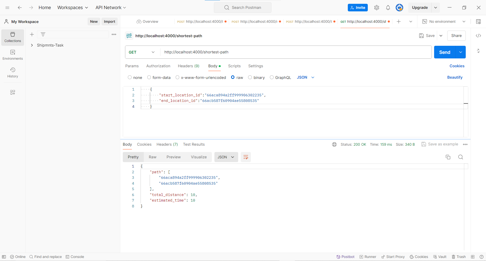

To Run This Code:
1. Clone the repo
     git clone https://github.com/shreyshah173/Shipmnts-Round1.git

2. Go to backend directory
    cd backend

3. Give commands 
    npm install
    nodemon server.js

This image shows the first endpoint i.e., /locations which has post method for the name , longititude and latitude data

This image shows the second endpoint i.e., /roads which has post method for the start_location_id , end_location_id , distance , traffic_condition (string can be clear, moderate, high)

This image shows the third endpoint i.e., /traffic-roads which has post method for the road_id,timestamp,
traffic_condition

This images the fourth endpoint i.e., / shortest-path which takes two parameters as input and give the path and estimated time and total distance in response
